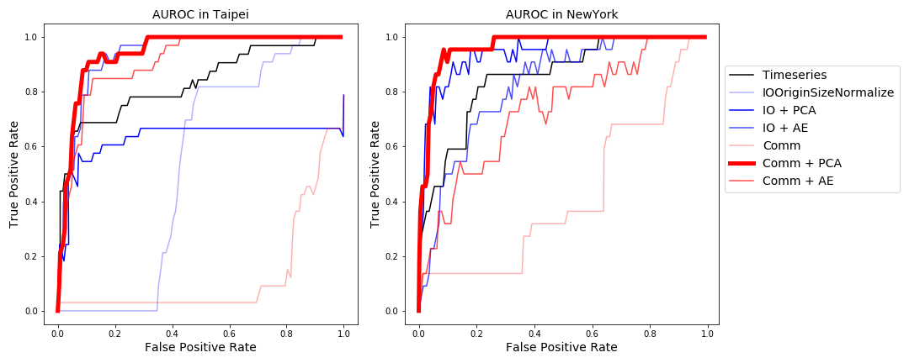

## Pattern and Anomaly Detection in Urban Temporal Networks
### Organization: NYU CUSP & Lockheed Martin
### Sponsor: Stan Sobolevsky & Sergey Malinchik
#### Mingyi He, Urwa Muaz, Shivam Pathak, Saloni Saini, Jingtian Zhou  
**Abstract**

Broad spectrum of urban activities including mobility can be modeled as temporal networks evolving over time. Abrupt changes in urban dynamics caused by events such as disruption of civic operations, mass crowd gatherings, holidays and natural disasters are potentially reflected in these temporal mobility networks. Identification and early detecting of such abnormal developments is of critical importance for transportation planning and security. 
Anomaly detection from high dimensional network data is a challenging task as edge level measurements often have low values and high variance resulting in high noise-to-signal ratio. In this study, we propose a generic three-phase pipeline approach to tackle curse of dimensionality and noisiness of the original data. Our pipeline consists of i) initial network aggregation leveraging community detection ii) unsupervised dimensionality reduction iii) clustering of the resulting representations for outlier detection. We perform extensive experiments to evaluate the proposed approach on mobility data collected from two major cities, New York City and Taipei. 
Our results empirically prove that proposed methodology outperforms traditional approaches for anomaly detection.
We further argue that the proposed anomaly detection framework is potentially generalizable to various other types of temporal networks e.g. social interactions, information propagation and  epidemic spread.

**Result**

