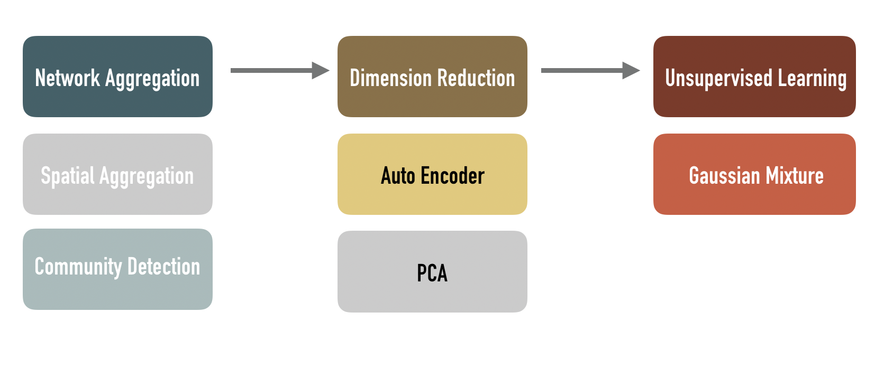

## Pattern and Anomaly Detection in Urban Temporal Networks
### Organization: NYU CUSP & Lockheed Martin
### Sponsor: Stan Sobolevsky & Sergey Malinchik
#### Mingyi He, Urwa Muaz, Shivam Pathak, Saloni Saini, Jingtian Zhou  
**Abstract**

A large array of urban activities including mobility can be modeled as networks evolving over time. These networks potentially capture the changes in urban dynamics caused by events like strikes and weather extremities, but identification of these events from temporal networks is a challenging problem and we intend to address it in this research. Our approach is a topological aggregation of the network followed by dimensionality reduction using representation learning, enabling the application of standard outlier detection to low dimensional representation space. We will evaluate the methodology by its ability to identify specific urban events. We expect our research to produce a methodology for anomaly detection in temporal networks of urban mobility that outperforms the legacy techniques and is generalizable to different types of temporal networks. Our motivations to pursue this problem is our belief that such a system can be used in early detection of potentially unsafe developments and enable a timely response.

**Result**
| city    | Method                             | GMM Component | GMM Threshold      | Balanced ACC      | National Holiday TPR | Culture Event TPR  | Extreme Weather TPR |
|---------|------------------------------------|---------------|--------------------|-------------------|----------------------|--------------------|---------------------|
| Taipei  | Comm + PCA + GMM                   | 2             | 0.2                | 0.865540789959395 | 1                    | 1                  | 0.2                 |
| DC      | Comm + PCA + GMM                   | 3             | 0.5                | 0.596641125820278 | 0.80952380952381     | 0.727272727272727  | 0.564102564102564   |
| Chicago | Comm + PCA + GMM                   | 5             | 0.3                | 0.512207425343019 | 0.1                  | 0.666666666666667  | 0.347826086956522   |
| NewYork | Comm + PCA + GMM                   | 4             | 0.110958904109589  | 0.590347923681257 | 0.523809523809524    | 0.2                | 0.177777777777778   |
| DC      | TimeSeries                         | 1             | 0.2                | 0.58958777336175  | 0.75                 | 0.0909090909090909 | 0.325               |
| Taipei  | TimeSeries                         | 1             | 0.1                | 0.786166574228138 | 0.724137931034482    | 0                  | 0.4                 |
| NewYork | TimeSeries                         | 1             | 0.2                | 0.584861325115562 | 0.666666666666666    | 0.411764705882352  | 0.195652173913043   |
| Chicago | TimeSeries                         | 2             | 0.2                | 0.569299055829228 | 0.6                  | 0.5                | 0.260869565217391   |
| Taipei  | Comm + GMM                         | 1             | 0.3                | 0.812384643779993 | 0.96551724137931     | 1                  | 0.4                 |
| DC      | Comm + GMM                         | 1             | 0.3                | 0.613141524105754 | 0.761904761904762    | 0.545454545454545  | 0.333333333333333   |
| Chicago | Comm + GMM                         | 3             | 0.0807113543091655 | 0.511412933817595 | 0.3                  | 0                  | 0.0652173913043478  |
| NewYork | Comm + GMM                         | 1             | 0.5                | 0.593733949666153 | 0.904761904761905    | 0.6                | 0.577777777777778   |
| Chicago | Auto Encoder + Community detection | 3             | 0.1                | 0.510214891041162 | 0                    | 0                  | 0.148936170212766   |
| DC      | Auto Encoder + Community detection | 3             | 0.2                | 0.517875431475932 | 0.0731707317073171   | 0.193548387096774  | 0.268292682926829   |
| NewYork | Auto Encoder + Community detection | 1             | 0.2                | 0.540270882078792 | 0.380952380952381    | 0.352941176470588  | 0.212765957446809   |
| Taipei  | Auto Encoder + Community detection | 1             | 0.2                | 0.83610188261351  | 0.9                  | 0.666666666666667  | 0.2                 |
| DC      | InOutFlowAutoEncoder               | 5             | 0.5                | 0.486638470583773 | 0.285714285714286    | 0.590909090909091  | 0.512820512820513   |
| NewYork | InOutFlowAutoEncoder               | 2             | 0.3                | 0.588179345241492 | 0.523809523809524    | 0.666666666666667  | 0.355555555555556   |
| Chicago | InOutFlowAutoEncoder               | 3             | 0.5                | 0.514199959644875 | 0.3                  | 1                  | 0.543478260869565   |
| Taipei  | InOutFlowAutoEncoder               | 4             | 0.3                | 0.812384643779993 | 1                    | 1                  | 0.2                 |
| DC      | InOutFlowPCA                       | 3             | 0.4                | 0.583877024617836 | 0.714285714285714    | 0.409090909090909  | 0.538461538461538   |
| Taipei  | InOutFlowPCA                       | 4             | 0.2                | 0.865540789959395 | 1                    | 1                  | 0.2                 |
| Chicago | InOutFlowPCA                       | 3             | 0.2                | 0.548085653753027 | 0.2                  | 0.666666666666667  | 0.282608695652174   |
| NewYork | InOutFlowPCA                       | 1             | 0.3                | 0.622895622895623 | 0.857142857142857    | 0.533333333333333  | 0.355555555555556   |

